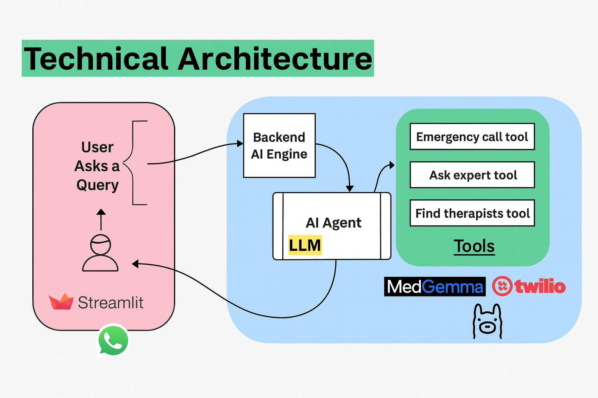

# AI_Therapist_Whatsapp_bot

## Flow chart

SafeSpace is an AI-powered mental health companion that combines a chat-style frontend, an LLM-based backend agent, and integrations with Twilio WhatsApp and Google Maps. It is designed to offer empathetic, tool-augmented support, including:

- Conversational mental health guidance using a therapeutic LLM (MedGemma via Groq)
- Detection of crisis scenarios with an emergency call tool (Twilio voice)
- A location-aware tool that finds nearby therapists using Google Maps
- A simple Streamlit chat UI for web, plus a Twilio WhatsApp webhook for chat over WhatsApp

The project is structured as a small, opinionated demo of how to build a **tool-using AI agent** for mental health support.

## Project Structure

```text
safespace-ai-therapist/
├── backend/
│   ├── ai_agent.py         # LangGraph-based AI agent + tools (LLM, emergency call, therapist finder)
│   ├── config.py           # API keys and configuration (not shown here; you create it)
│   ├── main.py             # FastAPI backend (JSON /ask + Twilio WhatsApp /whatsapp_ask)
│   ├── tools.py            # Low-level tool implementations (MedGemma, Twilio call, etc.)
│   └── test_location_tool.py  # Tests/examples for the location tool
├── frontend.py                             # Main project README
```

### Key Components

- **`frontend.py`**
  - A Streamlit app that:
    - Renders a chat interface with `st.chat_input` and `st.chat_message`.
    - Sends user messages to the backend endpoint `POST /ask` on `http://localhost:8000/ask`.
    - Displays the AI agent's response along with the name of any tool that was used.

- **`backend/main.py`**
  - Defines a FastAPI application with two main endpoints:
    - `POST /ask`: JSON API used by the Streamlit frontend.
    - `POST /whatsapp_ask`: Twilio WhatsApp webhook endpoint that receives form-encoded messages (Body field) and responds with TwiML.
  - Uses `ai_agent.graph` (LangGraph REAct agent) with `parse_response` to generate responses.
  - Includes a helper `_twiml_message()` to build minimal TwiML XML responses for Twilio.

- **`backend/ai_agent.py`**
  - Declares several LangChain tools using `@tool`:
    - `ask_mental_health_specialist(query: str) -> str`
      - Uses `query_medgemma()` (from `tools.py`) to call a MedGemma-based model for therapeutic responses.
    - `emergency_call_tool() -> None`
      - Uses `call_emergency()` (from `tools.py`) to trigger a Twilio voice call to a safety helpline.
    - `find_nearby_therapists_by_location(location: str) -> str`
      - Uses the Google Maps API to geocode a location and return nearby therapists (name, address, phone).
  - Configures the LLM:
    - Uses `ChatGroq` with model `"openai/gpt-oss-120b"` and `GROQ_API_KEY` from `config.py`.
    - Creates a REAct agent via `create_react_agent(llm, tools=tools)`.
  - Defines a `SYSTEM_PROMPT` with instructions for when to use each tool.
  - Provides `parse_response(stream)` to extract the final message and which tool was called from the streaming agent output.

- **`backend/config.py`** (implied)
  - Should provide configuration values such as:
    - `GROQ_API_KEY`
    - `GOOGLE_MAPS_API_KEY`
    - Twilio credentials (e.g., `TWILIO_ACCOUNT_SID`, `TWILIO_AUTH_TOKEN`, phone numbers)
  - You create this file yourself and **do not commit your secrets**.

- **`backend/tools.py`** (implied)
  - Implements the concrete integrations:
    - `query_medgemma(query: str) -> str`
    - `call_emergency() -> None`
    - Optional helpers for Google Maps / Twilio

---

## Tech Stack

- **Language:** Python (>= 3.11)
- **Backend:** FastAPI + Uvicorn
- **Frontend:** Streamlit
- **LLM / Agent:**
  - `langchain`
  - `langgraph`
  - `langchain-groq` with `ChatGroq`
- **Integrations:**
  - Twilio (WhatsApp + Voice)
  - Google Maps API (Places + Geocoding)
  - Geopy / Requests (supporting utilities)

Dependencies (from `pyproject.toml`):

- `fastapi`
- `geopy`
- `googlemaps`
- `langchain`
- `langchain-groq`
- `langchain-openai`
- `langgraph`
- `ollama`
- `pydantic`
- `python-multipart` (needed for FastAPI form parsing, e.g. Twilio webhooks)
- `requests`
- `streamlit`
- `twilio`
- `uvicorn`

---

## Prerequisites

- Python **3.11+** installed on your system.
- [`uv`](https://github.com/astral-sh/uv) installed (for virtual environment + dependency management).
- API keys / credentials for:
  - **Groq** (LLM): `GROQ_API_KEY`
  - **Google Maps**: `GOOGLE_MAPS_API_KEY`
  - **Twilio**:
    - `TWILIO_ACCOUNT_SID`
    - `TWILIO_AUTH_TOKEN`
    - Verified phone numbers / WhatsApp sandbox setup.

---

